# Dagmar Glemme Art
The main goals of this website is to (1) provide an introduction to the artistry of the great artist and sculpter Dagmar Glemme, (2) provide information about the artists wereabouts and main place of business and (3) encourage potential costomers to reach out to the artist for a planned visit.

The targeted audience for this website are people who in one way or form might have seen or heard about an artpiece of Dagmars and wants to know more about the artist and her artistry. It is like a CV in the sense that it is aimed to leave the user with a clear understanding of what type of artist Dagmar is and also give an approximate taste of how she expresses her ideas in different types of materials. The ways it differs from a CV is first and foremost the format and in such that the target audience aren't just employers/recruiters, but also potential art byers. This leaves room for longer format text and a more playfull approach to the layout. The artist herself has even encouraged me to be playful with the spacing of different elements, formalia is therefore secondary. The website is also in and of itself designed to be a pleasant user experience in a broader context than just a snappy CV.

The usefulness of the website is broad. It can be used for areas such as marketing the artist towards both private and corporate art byers, or even as a resource for journalists or gallerists writing about Dagmar Glemme.
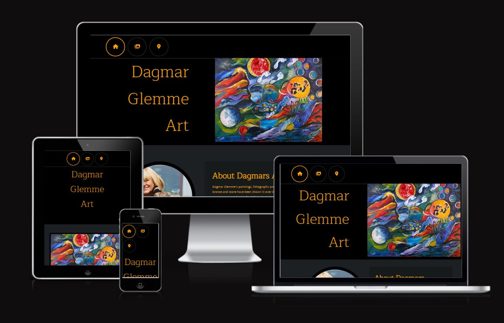

# Features
## Header
In the top left the user will see a navbar throughout the website with big buttons containing fontawesome icons to indicate the different pages of the website. The circles around the icons respond with a color change when hovered, and also activates when clicked to indicate where the user currently is on the website. The size of the buttons are however not responsive. This should be seen as a feature rather than a bug, because it was requested by the client as a way to make it easy for people with impaired vision to navigate through the pages, despite screensize.
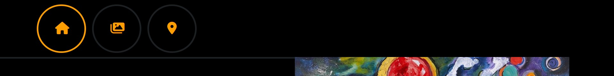

## Footer
The footer, which like the header stays in place throughout the pages, features matching buttons with icons that lead the user to Dagmars social media outlets by opening a new tab in the users browser, and redirecting them to said tab.
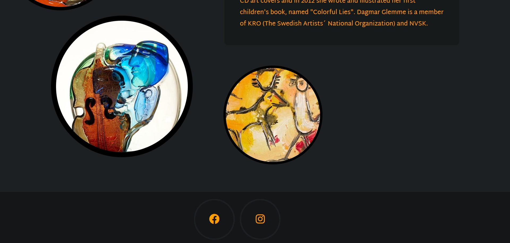

## Home page
The home page features a banner situated right under the heading, containing an oilpainting on canvas to the right and the logo to the left. This landing was designed to give an elegant impression and to also quickly get the user a taste of the type of art on the website.
The homepage also features an "about Dagmar" section accompanied by some more images of art and a profile picture, inside what looks like circle containers. The thought process behind this was to quickly engage the user and maybe answer some key questions about Dagmars artistry; questions that the user might have had before entering the site.
The playfull design of the circles are placed in a manner that is meant to induce the user with the feeling of some sort of movement. Because of the way they aline (while using a laptop) they in some ways resemble something like a swipe of a paintbrush, or planets of lesser mass alining around some other greater mass in cosmos.

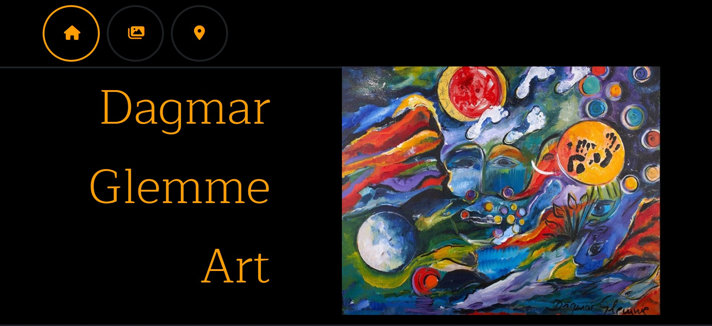
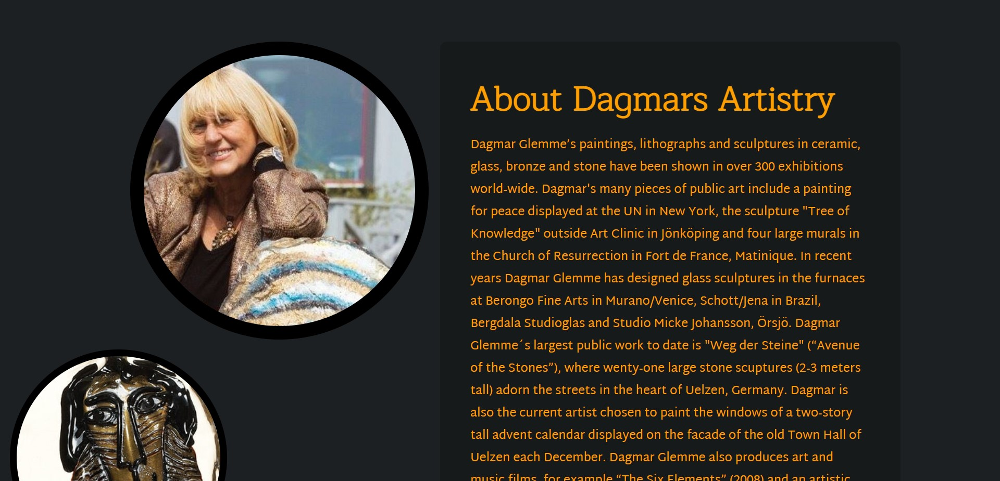


## Gallery page
The Gallery page features a masonry style photo wall structured into three columns that display a sample of artworks. The number or columns will decrease as the device gets smaller. These photos are as stated just a sample of artworks, and will continually be updated with newer more relevant work. As of now these are the best images at hand but will as stated be updated. 

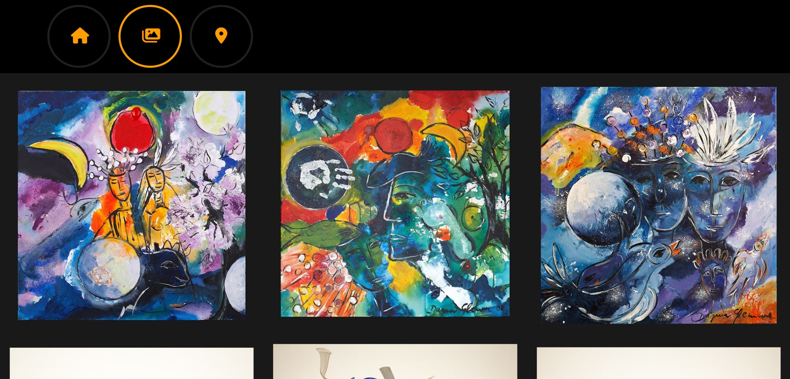
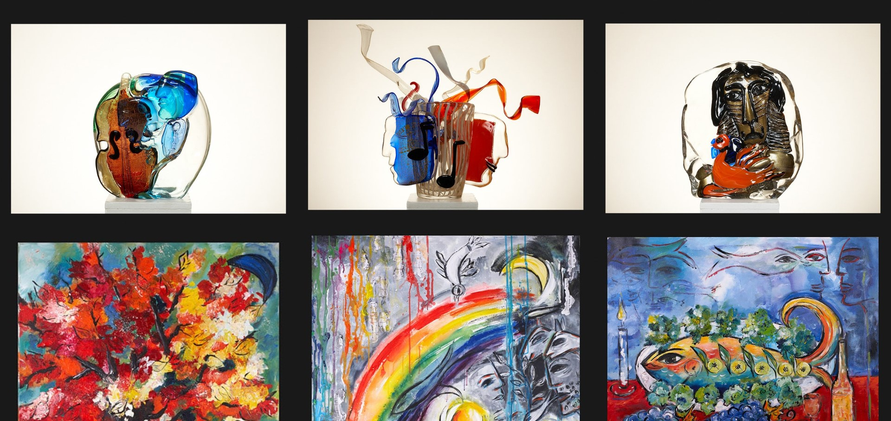
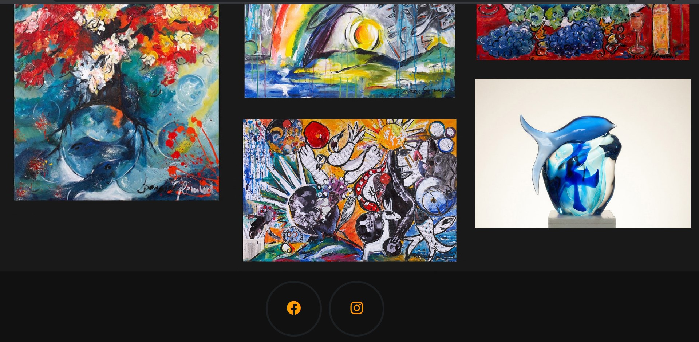

## Visit Dagmar page
This page features contact information, some short information about Dagmars main place of business, how to book a visit and an iframe element containing a fully interactable and ready to use google maps session with Dagmars address already entered. The intention behind this page is to create a way of engouraging the user to take action and start planning their route to Dagmar Glemme Art Center.
#### Bonus feature:
While on the site with an iphone, all phone numbers on screen are by iOS default clickable, and will open a menu that suggests the user to call Dagmar or cancel the action.

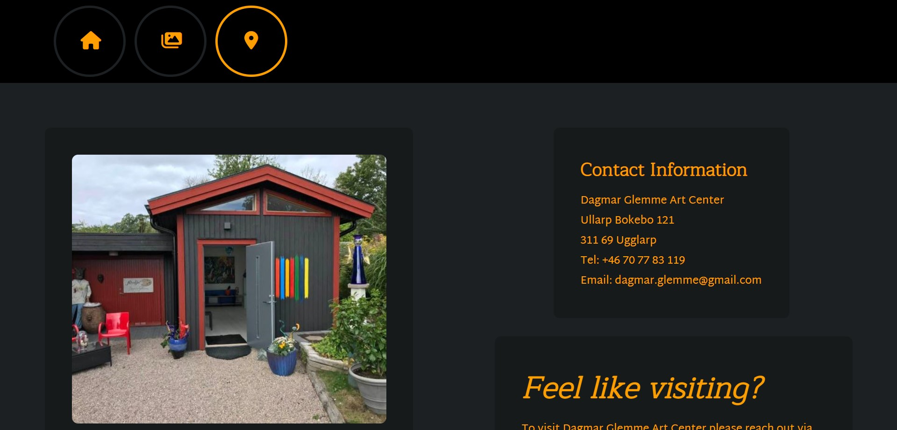
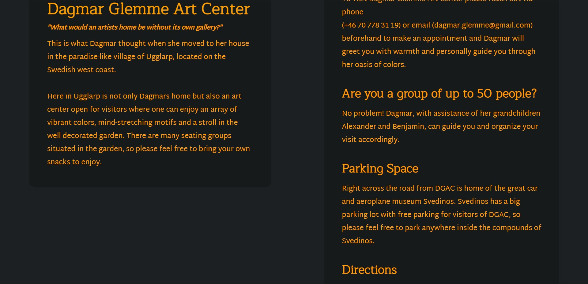
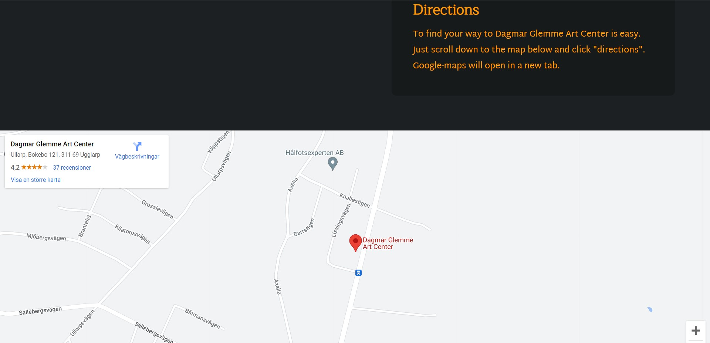

# Choice of colors
The choice to go with a gray, black and orange layout was made based on two reasons. 
1. Grey and damp colors gives a popping effect to the paintings while still maintaining a heavy feeling in the art, as opposed to white, which gives an airated and lighter feel to objects surrounded by it. Now depending on the art you are displaying, light or heavy colors can be preferred (e.g glass sculptures with lots of clear glass usually like to have white and light surroundings). In this case I suggested darkish/grayish to the client, who wholeheartedly agreed. The orange follow the same logic of accompanying the art whilst not stealing too much attention from it.
2. Orange and charcoal happens to be one of the clients favourite color combinations.

# Testing
- The website has been tested and works in Safari, Chrome and Edge.
- All extrernal sources open in new tabs.
- The HTML source code passes through the Wc3 validator without any warnings or errors, the same goes for the CSS in the Jigsaw validator.
- The sites lighthouse score is 100 on all assessments except on "Performance" where the lowest performance score was 95 for the visitdagmar.html page.


# Bugs
1. As I deployed the website some of the images went missing in the deployed version. This was solved by renaming the images in all lowercasing. The reason behind the fact that the images were showing in the local host version of the site and not in the deployed version was probably that I'm working in Windows, which by default is not case sensitive, while GitHub pages uses Unix, which is case sensitive.
2. While running the deployed version on an iphone, phone numbers in the visitdagmar.html turned into anchored links instead of text, causing them to inherit the anchor element style rules which caused them to mess up the text. This was fixed by entering a new style rule that targeted all decendant anchors of the .text-container class like so: 

```
.text-container a {
    text-decoration: none;
    margin: 0;
    padding: 0;
    top: 0;
    position: unset;
    border: 0px;
    border-radius: 0%;
} 
```
While this fixed the phone number problem, the instagram and facebook anchors also inherited the code. To fix this I could have just specified my combinators better, but instead I chose to just reapply the old anchor rules to the decendant anchors of the #instagram and #facebook ids further down in the stylesheet like this:

```
#facebook a, #instagram a {
    text-decoration: none;
    color: rgb(254, 158, 0);
    position: relative;
    top: 30px;
    border: 1px;
    border-radius: 90%;
    padding: 40px;
}
```
## Unfixed bugs
There are no unfixed bugs that I am aware of at this point in time.

# Credits
## Content
### Icons
- All icons where taken from fontawesome.com
### Code
- The image styling in the gallery page of the site was taken from/heavily inspired by the Code Institutes [Love Running Project gallery page](https://github.com/Code-Institute-Solutions/love-running-2.0-sourcecode/tree/main/07-gallery/02-gallery-images). The specific snippets of code taken were:

```
#photos {
    clear: both;
    line-height: 0;
    column-count: 4;
    column-gap: 0;
}

#photos > img {
    width: 100%;
}
```
- I've at times turned to w3schools.com to get explanations about syntax and what it does and how to use it, and sometimes copied syntax from there but then applied it in my own way.
### About Dagmars Artistry text-content
- The text-content on the home page about Dagmars artistry was taken directly out of Dagmar Glemmes CV, which was sent to me in purpose of using on this website.

## Media
- All images were handed to me by Dagmar Glemme.
